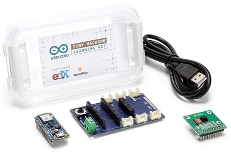
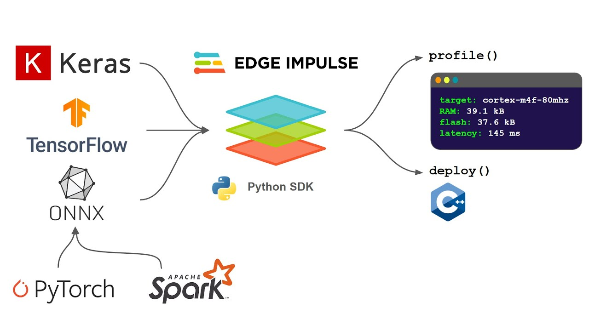

<h1>Laboratorio 8: Uso del Kit Arduino TinyML</h1>

En este laboratorio conoceremos los aspectos básicos del TinyML con el Arduino 33 BLE Sense y exploraremos la plataforma Edge Impulse.

<h2>Materiales utilizados:</h2>
<table>
  <tr>
    <th>Descripción</th>
    <td>Cantidad</td> </tr>
    <tr><td>Laptop o Pc</td>
    <td>1</td></tr>
    <tr><td>Arduino nano 33 BLE</td>
    <td>1</td></tr>
    <tr><td>Cámara OV7675</td>
    <td>1</td></tr>
    <tr><td>Tiny ML Shield</td>
    <td>1</td></tr>
    <tr><td>Cable USB</td>
    <td>1</td></tr>
<table>

<h2>¿Qué es el Kit Arduino TinyML?</h2>

Arduino TinyML es un kit de desarrollo basado en la plataforma Arduino que está diseñado para permitir la implementación de aprendizaje automático en dispositivos de recursos limitados, como microcontroladores. TinyML es una abreviatura de "Machine Learning" (aprendizaje automático) en entornos pequeños.

<h2>¿Qué es Edge Impulse?</h2>

Edge Impulse es una plataforma de desarrollo y despliegue de aprendizaje automático (machine learning) para sistemas de edge computing. Permite a los desarrolladores crear y entrenar modelos de aprendizaje automático utilizando datos provenientes de sensores o dispositivos periféricos, y luego implementar esos modelos directamente en dispositivos de borde, como microcontroladores y sistemas embebidos.

  

<h2>Archivos utilizados</h2>

<h2>Video</h2>