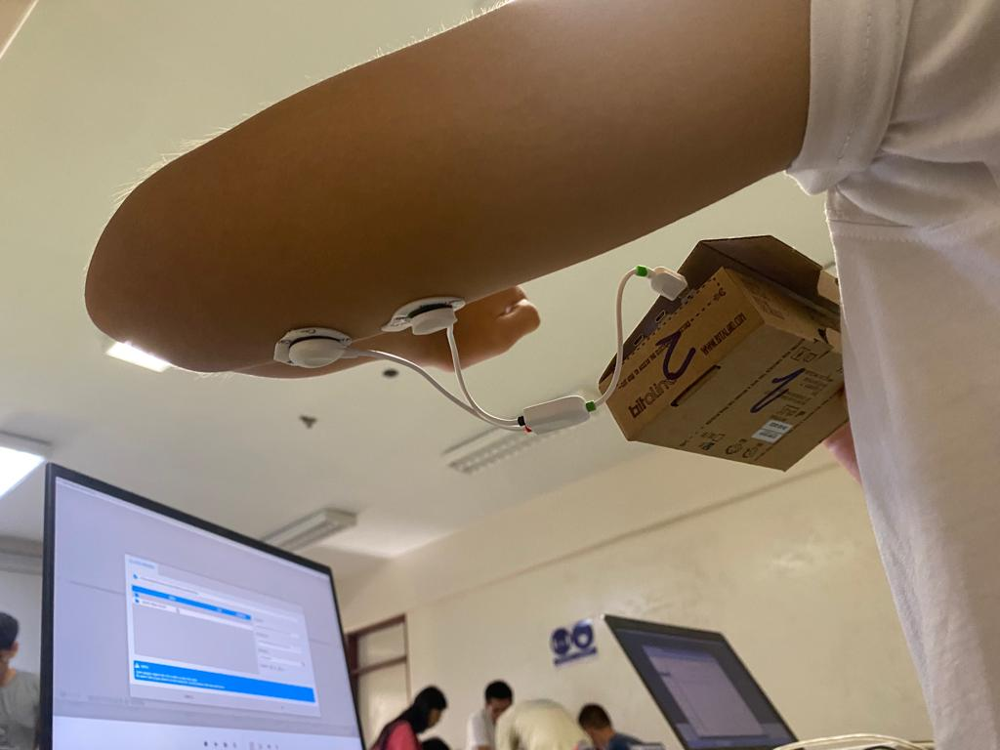

<h1>Laboratorio 3: Uso de BiTalino para EMG y ECG</h1>

En este labotorio utilizaremos Bi Talino para electromiografía(EMG) y electrocardiograma(ECG). Aprenderemos a adquirir señales biomédicas, configurar correctamente Bi Talino y extraer información de las señales EMG y ECG del software OpenSignals (r)evolution.

<h1>Tabla de Contenidos</h1>
<ul>
  <li> <a href="#Objetivos"> Objetivos </a> </li>
  <li> <a href="#materiales"> Materiales y Equipos </a> </li> 
  <li> <a href="#proce"> Procedimiento  </a> 
  	<ul>
  		 <li> <a href="#conex"> Conexión  </a> </li> 
      <li> <a href="#obt"> Obtención de la señal  </a> </li> 
      <li> <a href="#señan"> Señal en Python </a> </li> 
  	</ul>
   <li> <a href="#disc"> Discusión </a> </li>
  </li>
  <li> <a href="#res"> Resultados </a> 
  	<ul>
  		<li> <a href="#señal"> Señal en OpenSignals </a> </li> 
      <li> <a href="#archiv"> Archivos </a> </li> 
  	</ul>
  </li>
</ul>
<h2 id="Objetivos">Objetivos</h1>
<ul>
  <li> </a> Adquirir señales biomédicas de EMG y ECG </a> </li> 
  <li> </a> Hacer una correcta configuración de BiTalino </a> </li> 
  <li> </a> Extraer la información de las señales EMG y ECG del software OpenSignals (r)evolution</a> </li> 
</ul>
<h2 id="materiales">Materiales y Equipos</h1>
<table>
  <tr>
    <th>Modelo</th>
    <th>Descripción</th>
    <th>Cantidad </th>
  </tr>
  <tr>
    <td>(R)EVOLUTION</td>
    <td>Kit BITalino</td>
    <td>1</td>
  </tr>
    <tr>
    <td>-</td>
    <td>Laptop o PC</td>
    <td>1</td>
  </tr>
</table>
<h2 id="proce">Procedimiento</h1>
<ul>
<h2 id="conex">Conexión</h1>
  <ul>
  <li> </a> Electrodos-cuerpo</a> </li> 
  <li> </a> BITalino-cables</a> </li> 
  </ul>
<h2 id="obt">Obtención de la señal </h1>

https://user-images.githubusercontent.com/123878192/230742542-d72c83f2-d51d-432f-b0d4-fc0837c4b745.mp4

<h2 id="señan">Señal en Python </h1>

 En el archivo de texto obtenido del OpenSignal se menciona que la frecuecia de muestreo es de 1000Hz, entonces tiene un tiempo de muestreo de 1 ms. Se pasaron los datos de la señal en un excel y se agrego una variable de tiempo con 1 ms entre cada muestra, después se uso python para poder realizar la gráfica de la señal.
  

</ul>
<h2 id="disc">Discusión</h1>
<ul>
  
 Analizando la señal pudimos ver que la mayor contraccion muscular y actividad electrica se dio entre 1.4s y 3.3s, 4.9s y 7.1s, 9.4s y 12.7s ,y 13.8s y 15.2s que coincide naturalmente con los momentos en que nuestro compañero con los electrodos ejerció fuerza en su brazo.
</ul>
<h2 id="res">Resultados</h1>
<ul>
  <li> </a> Podemos observar en la señal los periodos de tiempo cuando se reclutan la mayor cantidad de grupos musculares durante la contraccion reflejado en una mayor actividad electrica y mayor amplitud de la señal.
  <li> </a> Tambien se identifico los periodos de tiempo en los que el musculo esta activo o en reposo.
</ul>
<h2 id="señal">Señal en OpenSignals</h1>

<h2 id="archiv">Archivos</h1>

[Archivos_BiTalino.zip](https://github.com/EduardoSalazarA/IntroSenales/files/11184266/Archivos_BiTalino.zip)
</ul> 

