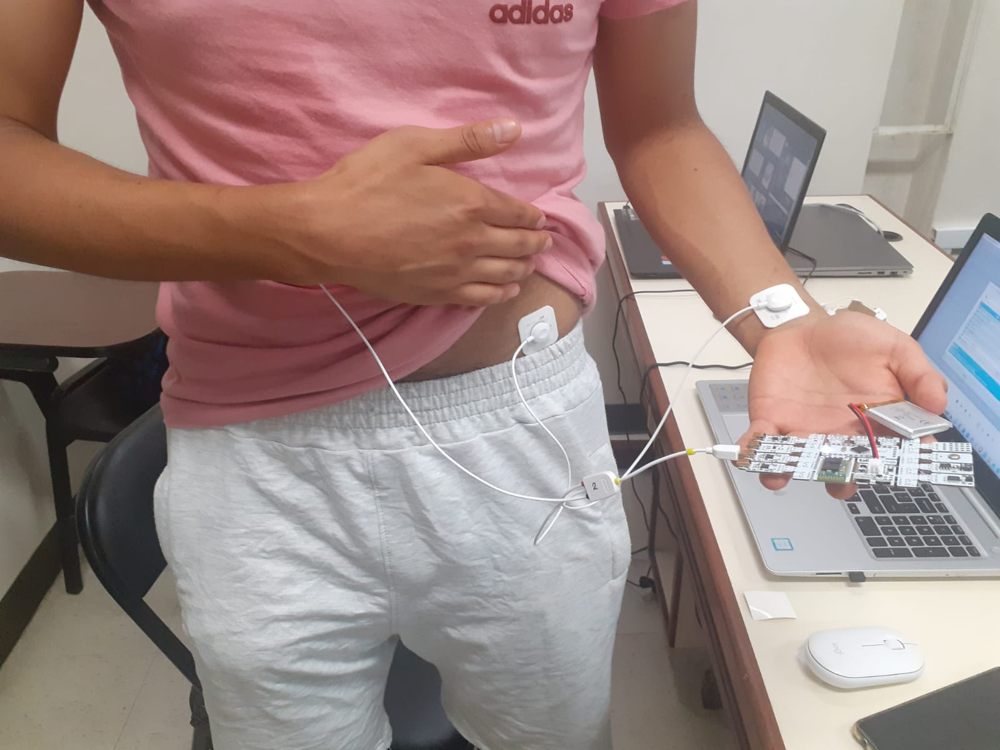
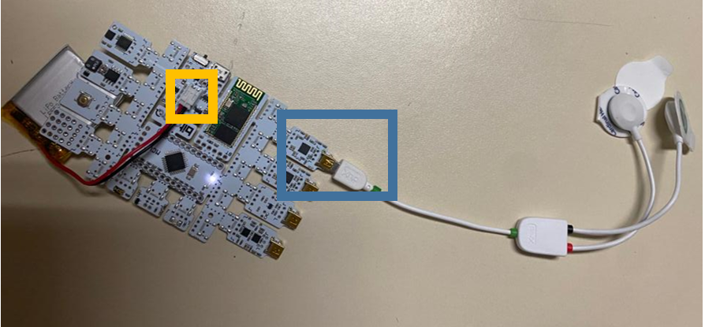

<h1>Laboratorio 4: Uso de BiTalino para ECG</h1>

En este labotorio utilizaremos Bi Talino para electromiografía(EMG). Aprenderemos a adquirir señales biomédicas, configurar correctamente Bi Talino y extraer información de las señales EMG del software OpenSignals (r)evolution.

<h1>Tabla de Contenidos</h1>
<ul>
  <li> <a href="#Objetivos"> Objetivos </a> </li>
  <li> <a href="#materiales"> Materiales y Equipos </a> </li> 
  <li> <a href="#proce"> Procedimiento  </a> 
  	<ul>
  		 <li> <a href="#conex"> Conexión  </a> </li> 
      <li> <a href="#obt"> Obtención de la señal  </a> </li> 
      <li> <a href="#señan"> Señal en Python </a> </li> 
  	</ul>
   <li> <a href="#disc"> Discusión </a> </li>
  </li>
  <li> <a href="#res"> Resultados </a> 
  	<ul>
  		<li> <a href="#señal"> Señal en OpenSignals </a> </li> 
      <li> <a href="#archiv"> Archivos </a> </li> 
  	</ul>
  </li>
</ul>
<h2 id="Objetivos">Objetivos</h1>
<ul>
  <li> </a> Adquirir señales biomédicas de EMG y ECG </a> </li> 
  <li> </a> Hacer una correcta configuración de BiTalino </a> </li> 
  <li> </a> Extraer la información de las señales EMG y ECG del software OpenSignals (r)evolution</a> </li> 
</ul>
<h2 id="materiales">Materiales y Equipos</h1>
<table>
  <tr>
    <th>Modelo</th>
    <th>Descripción</th>
    <th>Cantidad </th>
  </tr>
  <tr>
    <td>(R)EVOLUTION</td>
    <td>Kit BITalino</td>
    <td>1</td>
  </tr>
    <tr>
    <td>-</td>
    <td>Laptop o PC</td>
    <td>1</td>
  </tr>
</table>
<h2 id="proce">Procedimiento</h1>
<ul>
<h2 id="conex">Conexión</h1>
  <ul>
  <li> </a> Electrodos-cuerpo</a> </li> 
  
Los electrodos se colocaron de dos maneras como se puede ver en las imágenes, en el primer sujeto de prueba se conecto el electrodo de referencia en la parte inferior izquierda del abdomen y los otros dos electrodos en las muñecas; en el segundo sujeto de prueba se conecto el electrodo de referencia en la parte del tobillo derecho y los otros dos electrodos en las muñecas.
Dichos electrodos cuentan con un material conductor metálico recubierto de una capa aislante y son capaces de detectar esa diferencia de potencial producida por la actividad eléctrica muscular y convertirla en una señal eléctrica.

  

  

  <li> </a> BITalino-cables</a> </li> 
  
Para conectar el BITalino-cables usamos el manual de usuario para poder distinguir los puertos a utilizar. 

  

  
 Manual de usuario: https://support.pluxbiosignals.com/wp-content/uploads/2021/11/bitalino-revolution-user-manual.pdf"

  
Vamos a utilizar el puerto A1, señalado en el recuadro azul pues este nos permitirá obtener la señal de la actividad del músculo, electromiografía (EMG).

  
Para poder alimentar la placa conectaremos la fuente de poder que será una batería de litio (recuadro anaranjado).

  
  </ul>
<h2 id="obt">Obtención de la señal </h1>

 Una vez colocados los electrodos, se puede observar en la pantalla de la laptop la señal en silencio eléctrico o reposo, que es cuando el músculo del brazo  está relajado. Después cuando el músculo se contrae, se puede observar actividad eléctrica en la señal, esto se debe a que las neuronas motoras transmiten señales eléctricas que hacen que los músculos se contraigan. Al terminar de tomar la muestra, gracias al software obtendremos archivos de la señal para poder analizarlos.

https://user-images.githubusercontent.com/123878192/230742542-d72c83f2-d51d-432f-b0d4-fc0837c4b745.mp4

<h2 id="señan">Señal en Python </h1>

 El archivo de texto obtenido del OpenSignal contiene 6 columnas de los cuales el último corresponde a la señal en bits que recibe el microcontrolador, esos valores se reescalan, en Python, a volts multiplicandolos por 3.3 V(voltaje de operación del ADC del microcontrolador) y se divide entre 1023, que corresponde al máximo valor decimal permitido por el ADC de 10 bits que presenta el BiTalino. Después de procesada la señal se usa la librería matplotlib de python para graficarla. El código usado es el siguiente:https://github.com/EduardoSalazarA/IntroSenales/blob/main/Software/Laboratorio_3_se%C3%B1al_EMG.py
  

  
</ul>
<h2 id="disc">Discusión</h1>
<ul>
  
 Analizando la señal pudimos ver que la mayor contraccion muscular y actividad electrica se dio entre 1.4s y 3.3s, 4.9s y 7.1s, 9.4s y 12.7s ,y 13.8s y 15.2s que coincide naturalmente con los momentos en que nuestro compañero con los electrodos ejerció fuerza en su brazo.
</ul>
<h2 id="res">Resultados</h1>
<ul>
  <li> </a> Podemos observar en la señal los periodos de tiempo cuando se reclutan la mayor cantidad de grupos musculares durante la contraccion reflejado en una mayor actividad electrica y mayor amplitud de la señal.
  <li> </a> Tambien se identifico los periodos de tiempo en los que el musculo esta activo o en reposo.
</ul>
<h2 id="señal">Señal en OpenSignals</h1>

<h2 id="archiv">Archivos</h1>

[Archivos_BiTalino.zip](https://github.com/EduardoSalazarA/IntroSenales/files/11184266/Archivos_BiTalino.zip)
</ul> 

