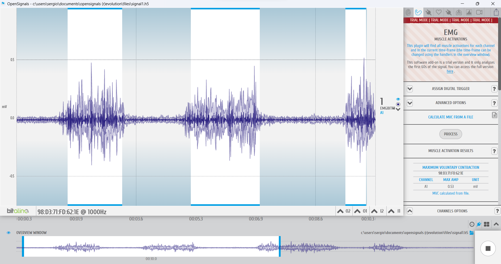

<h1>Laboratorio 3: Uso de BiTalino para EMG y ECG</h1>

Este es labotorio utilizaremos Bi Talino para electromiografía(EMG) y electrocardiograma(ECG). Aprenderemos a adquirir señales biomédicas, configurar correctamente Bi Talino y extraer información de las señales EMG y ECG del software OpenSignals (r)evolution.

img src="Imagenes/imagprincipal.jpg" width="500">

<h1>Tabla de Contenidos</h1>
<ul>
  <li> <a href="#Objetivos"> Objetivos </a> </li>
  <li> <a href="#materiales"> Materiales y Equipos </a> </li> 
  <li> <a href="#proce"> Procedimiento  </a> 
  	<ul>
  		 <li> <a href="#conex"> Conexión  </a> </li> 
      <li> <a href="#obt"> Obtención de la señal  </a> </li> 
      <li> <a href="#señan"> Señal en Python </a> </li> 
  	</ul>
   <li> <a href="#disc"> Discusión </a> </li>
  </li>
  <li> <a href="#res"> Resultados </a> 
  	<ul>
  		<li> <a href="#señal"> Señal en OpenSignals </a> </li> 
      
      <li> <a href="#archiv"> Archivos </a> </li> 
  	</ul>
  </li>
</ul>
<h2 id="Objetivos">Objetivos</h1>
<ul>
  <li> </a> Adquirir señales biomédicas de EMG y ECG </a> </li> 
  <li> </a> Hacer una correcta configuración de BiTalino </a> </li> 
  <li> </a> Extraer la información de las señales EMG y ECG del software OpenSignals (r)evolution</a> </li> 
</ul>
<h2 id="materiales">Materiales y Equipos</h1>
<tr>
    <th>Actividades</th>
    <td>Metafisica</td>
    <td>Escala Temporal (semanas)</td>
</tr>
<h2 id="proce">Procedimiento</h1>
  <h3 id="conex">Conexión</h1>
  

