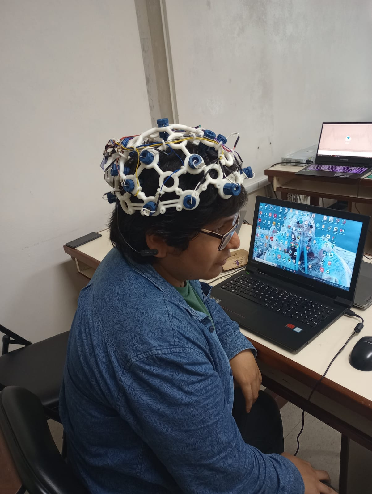
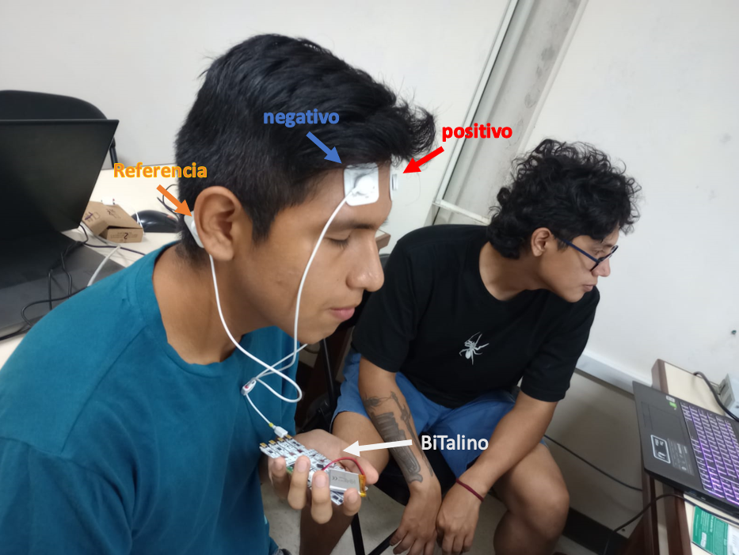
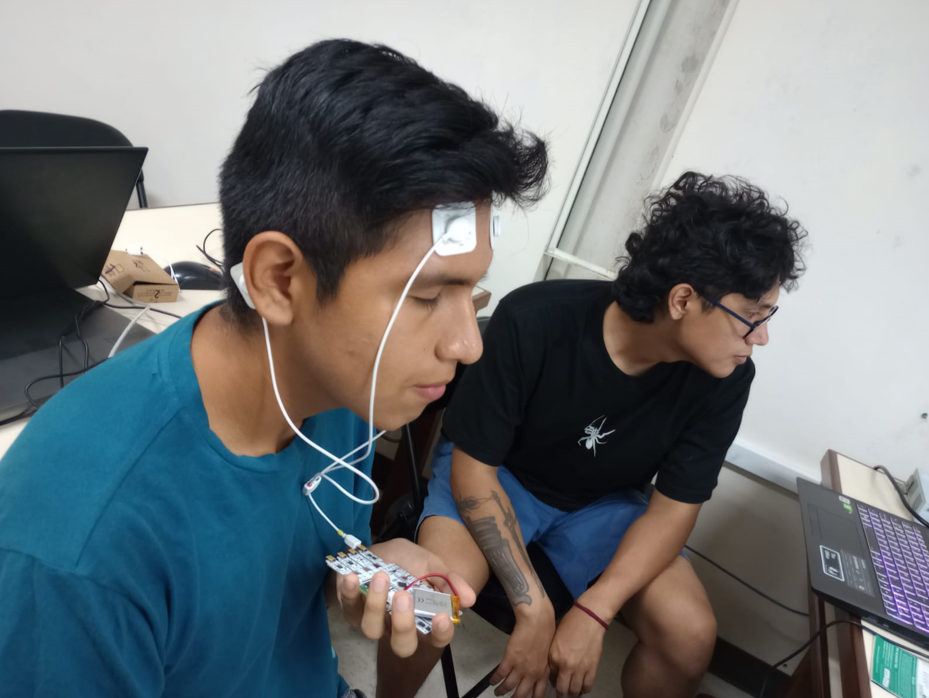
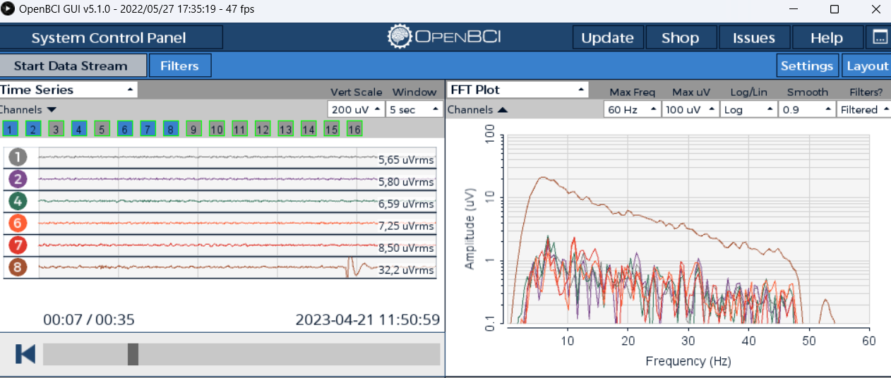

<h1>Laboratorio 5: Uso de BiTalino para ECG</h1>
<h1>Resumen y Explicación:</h1> 
  
El electroencefalograma (EEG) es una técnica no invasiva utilizada para medir la actividad eléctrica del cerebro mediante la colocación de electrodos en el cuero cabelludo. Es una herramienta importante para la evaluación de trastornos neurológicos y psiquiátricos, así como para la investigación en neurociencia.[1]

El EEG mide la actividad eléctrica del cerebro mediante la detección de las corrientes eléctricas generadas por las células cerebrales. Estas señales eléctricas se transmiten a través de las dendritas y los axones de las neuronas y pueden ser detectadas por los electrodos en la superficie del cuero cabelludo. La señal del EEG se registra y se visualiza como un trazado en papel o en una pantalla de ordenador, y puede ser analizada en términos de amplitud, frecuencia y forma de onda.[2]

El EEG se utiliza en una amplia variedad de aplicaciones clínicas y de investigación. En el ámbito clínico, se utiliza para evaluar la actividad eléctrica del cerebro en pacientes con trastornos neurológicos como la epilepsia, el coma y el traumatismo craneal. También se utiliza para evaluar trastornos psiquiátricos como la depresión, la ansiedad y la esquizofrenia. En la investigación, el EEG se utiliza para estudiar la actividad eléctrica del cerebro durante tareas cognitivas y emocionales, y para investigar las bases neurofisiológicas de los trastornos neurológicos y psiquiátricos.[3]

Aunque el EEG es una técnica relativamente sencilla y no invasiva, su interpretación requiere experiencia y habilidad por parte del especialista que lo analiza. La interpretación del EEG se basa en el conocimiento de la anatomía y fisiología cerebral, así como en la comprensión de las características de la señal del EEG y de los patrones de actividad cerebral normales y anormales.[4]

<h1>Tabla de Contenidos</h1>
<ul>
  <li> <a href="#Objetivos"> Objetivos </a> </li>
  <li> <a href="#materiales"> Materiales y Equipos </a> </li> 
  <li> <a href="#proce"> Procedimiento  </a> 
  	<ul>
  		 <li> <a href="#conex"> Conexión  </a> </li> 
      <li> <a href="#obt"> Obtención de la señal  </a> </li>
      <li> <a href="#señalbci"> Señal en OpenBCI GUI </a> </li> 
      <li> <a href="#señalo"> Señal en OpenSignals </a> </li> 
      <li> <a href="#señalp"> Señales en Python </a> </li> 
  	</ul>
  </li>
  <li> <a href="#res"> Resultados </a> 
  	<ul>
      <li> <a href="#archiv"> Archivos </a> </li> 
  	</ul>
  </li>
</ul>
<h2 id="Objetivos">Objetivos</h1>
<ul>
  <li> </a> Adquirir señales biomédicas de EEG</a> </li> 
  <li> </a> Hacer un correcto uso del Ultracortex y extraer la información de la señal EEG del software Open BCI </a> </li> 
  <li> </a> Utilizar BiTalino y el software OpenSignals (r)evolution para obtener la señal EEG y analizarla</a> </li> 
</ul>
<h2 id="materiales">Materiales y Equipos</h1>
<table>
  <tr>
    <th>Modelo</th>
    <th>Descripción</th>
    <th>Cantidad </th>
  </tr>
  <tr>
    <td>(R)EVOLUTION</td>
    <td>Kit BITalino</td>
    <td>1</td>
  </tr>
  <tr>
    <td>-</td>
    <td>Laptop o PC</td>
    <td>1</td>
  </tr>
  <tr>
    <td>Mark IV</td>
    <td>Ultracortex</td>
    <td>1</td>
  </tr>
 </table>

<h2 id="proce">Procedimiento</h1>
<ul>
<h2 id="conex">Conexión</h1>
  <ul>
  <li> </a>Adquisición por Ultracortex</a> </li> 
  
Para la colocación del del casco Ultracortex se utilizó la posición estándar de 10/20 para la adquisición de señal EEG. Como se puede ver en la imagen:

  

  
  <li> </a>Adquisición por BiTalino</a> </li> 
  
Para la colocación del BiTalino nos basamos en la propia guia que proporciona BiTalino para la obtención de señales EEG (https://support.pluxbiosignals.com/wp-content/uploads/2022/04/HomeGuide3_EEG.pdf). Para esto se utilizaron tres electrodos con al siguiente colocación: el electrodo de referencia se colocó detrás de la oreja derecha, el electrodo positivo arriba de la ceja izquierda y el último electrodo negativo encima arriba de la ceja derecha, como se puede apreciar en la imagen:

  

  
  </ul>

<h2 id="obt">Obtención de la señal </h1>

Se realizo el procedimiento dado en la guia de laboratorio, el cual consistia en:

1. Registrar la señal en reposo durante 30 segundos.

2. Registrar la señal de un ciclo de OJOS ABIERTOS - OJOS CERRADOS cinco veces, manteniendo ambas fases durante cinco segundos.

3. Registrar la señal al hacer preguntas.

También para el caso de BiTalino se hizo un registro más de señal, que consistía en vendar los ojos al participante durante 1 minuto y que después mire un punto fijo con el flash del celular apuntado a la cara.

<ul>
  <li> </a>Adquisición por Ultracortex</a> </li> 
  
1. Registrar la señal en reposo durante 30 segundos.

  
https://user-images.githubusercontent.com/123878192/233757204-dba60039-ab18-4224-8871-8fb118d07448.mp4

  
2. Registrar la señal de un ciclo de OJOS ABIERTOS - OJOS CERRADOS cinco veces, manteniendo ambas fases durante cinco segundos.

https://user-images.githubusercontent.com/123878192/233757238-8c47f76f-908b-4600-9aa8-e1f36b1fb1f1.mp4

  
3. Registrar la señal al hacer preguntas.

  
  <li> </a>Adquisición por BiTalino</a> </li> 
  
1. Registrar la señal en reposo durante 30 segundos.

  
   

  
  
2. Registrar la señal de un ciclo de OJOS ABIERTOS - OJOS CERRADOS cinco veces, manteniendo ambas fases durante cinco segundos.

  

https://user-images.githubusercontent.com/123878192/233757413-20cbae95-5ba1-4717-9b73-45fc04a3d74c.mp4

  
3. Registrar la señal al hacer preguntas.

  

https://user-images.githubusercontent.com/123878192/233757963-10a14fa6-3e38-46b0-b584-1286276fafba.mp4

  
4. Registrar al vendar.

  

https://user-images.githubusercontent.com/123878192/233760625-cb12c3a7-787f-43ae-a44f-7fb2f77d4f3a.mp4

</ul>

<h2 id="señalbci">Señal en OpenBCI GUI</h1>

1. Registrar la señal en reposo durante 30 segundos.

2. Registrar la señal de un ciclo de OJOS ABIERTOS - OJOS CERRADOS cinco veces, manteniendo ambas fases durante cinco segundos.

 

3. Registrar la señal al hacer preguntas.

<h2 id="señalo">Señal en OpenSignals</h1>

1. Registrar la señal en reposo durante 30 segundos.

2. Registrar la señal de un ciclo de OJOS ABIERTOS - OJOS CERRADOS cinco veces, manteniendo ambas fases durante cinco segundos.

 

3. Registrar la señal al hacer preguntas.

4. Registrar al vendar.

<h2 id="señalp">Señales en Python </h1>
<ul>
  <li> </a>Ultracortex</a> </li> 
  
Señal base, ojos cerrados por 30 segundos 

  

  
Señal cuando se abre y cierra los ojos por intervalos de 5 segundos. 

  

  
Señal base por segunda vez, ojos cerrados por 30 segundos. 

  

  
Señal durante cuestionario al sujeto de pruebas. 

  

  
  <li> </a>BiTalino</a> </li> 
  
Señal base, ojos cerrados por 30 segundos 

  

  
Señal cuando se abre y cierra los ojos por intervalos de 5 segundos. 

  

  
Señal base por segunda vez, ojos cerrados por 30 segundos. 

  

  
Señal durante cuestionario al sujeto de pruebas. 

  

  

  
Señal con los ojos vendados y una posterior luz incidente en los ojos cerrados del sujeto de pruebas. 

  

 
  
Los picos pronunciados se observan debido a sensaciones como mover un dedo(en el caso de las respiraciones), resolver acertijos matemáticos e incluso estar expuesto a cambios de luminosidad.

  </ul>
  
</ul>
<h2 id="res">Conclusiones</h1>
<ul>
  <li> 
Los picos pronunciados se observan debido a sensaciones como mover un dedo(en el caso de las respiraciones), resolver acertijos matemáticos e incluso estar expuesto a cambios de luminosidad.
 </a>
</ul>

<h2 id="archiv">Archivos</h1>

</ul> 

 <h2> </a>Bibliografia</h1>

[1]Niedermeyer, E., & da Silva, F. L. (2004). Electroencephalography: basic principles, clinical applications, and related fields. Lippincott Williams & Wilkins.

[2]Kappenman, E. S., & Luck, S. J. (2012). The Oxford handbook of event-related potential components. Oxford University Press.

[3]Michel, C. M., & Koenig, T. (2018). EEG microstates as a tool for studying the temporal dynamics of whole-brain neuronal networks: a review. Neuroimage, 180, 577-593.

[4]Ibarretxe-Bilbao, N., Junqué, C., Marti, M. J., Tolosa, E., & Brain Reserve and Cognition Group. (2011). Neuropsychological and motor changes in patients with Parkinson's disease with or without depression. Journal of neurology, 258(4), 638-643.

