<h1>Laboratorio 4: Uso de BiTalino para ECG</h1>

En este labotorio utilizaremos Bi Talino para electromiografía(EMG). Aprenderemos a adquirir señales biomédicas, configurar correctamente Bi Talino y extraer información de las señales EMG del software OpenSignals (r)evolution.

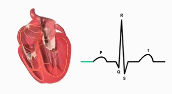

<h1>Tabla de Contenidos</h1>
<ul>
  <li> <a href="#Base"> Base Teórica</a> </li>
  <li> <a href="#Objetivos"> Objetivos </a> </li>
  <li> <a href="#materiales"> Materiales y Equipos </a> </li> 
  <li> <a href="#proce"> Procedimiento  </a> 
  	<ul>
  		 <li> <a href="#conex"> Conexión  </a> </li> 
      <li> <a href="#obt"> Obtención de la señal  </a> </li>
      <li> <a href="#señalo"> Señal en OpenSignals </a> </li> 
      <li> <a href="#señalp"> Señal en Python </a> </li> 
  	</ul>
   <li> <a href="#disc"> Discusión </a> </li>
  </li>
  <li> <a href="#res"> Resultados </a> 
  	<ul>
      <li> <a href="#archiv"> Archivos </a> </li> 
  <li> <a href="#refs"> Referencias  </a> 
</ul>
<h2 id="Base">Base Teórica</h1>

  <h2>Electrocardiograma</h1>
  
Es un gráfico en el que se estudian las variaciones de voltaje en relación con el tiempo. Consiste en registrar en papel milimetrado (para facilitar la medición), la actividad de la corriente eléctrica que se está desarrollando en el corazón durante un tiempo determinado [1]

 
La actividad eléctrica del corazón recogida en el ECG se observa en forma de un trazado que presenta diferentes deflexiones (ondas del ECG) que se corresponden con el recorrido de los impulsos eléctricos a través de las diferentes estructuras del corazón.[1]

</ul>
<ul>
<h2>Registro del ECG</h1>
  
Tenemos dos tipos de derivaciones[2]

  <ul>
    <li> </a> Plano frontal </a> </li>
    
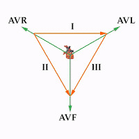

    <li> </a> Precordinales </a> </li>
    
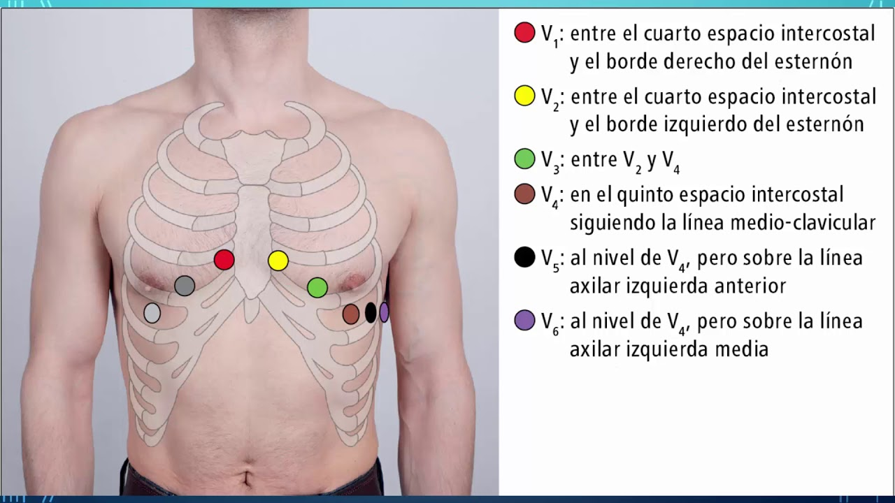

   </ul>
<ul>
<h2>Ondas y Complejos</h1>
  <ul>
    <li> </a> La despolarización auricular es la onda P estas son habitualmente ascendentes y ligeramente redondeadas</a> </li>
    <li> </a> La despolarización ventricular es la onda QRS </a> </li>
    <li> </a>La repolarización ventricular está representada por la onda T</a> </li>
    <li> </a> La onda U es relacionada con la repolarización tardía de los ventrículos</a> </li>
    <li> </a>Una onda de despolarización inicia desde el marcapaso, propagándose [2] </a> </li>
 </ul>   
</ul>
<ul>
<h2>Intervalos y Segmentos</h1>
  
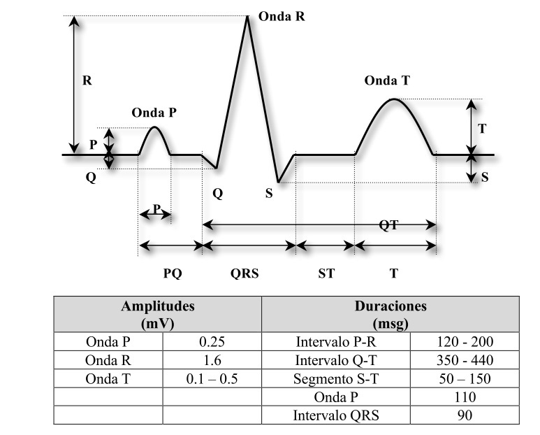

</ul>
</ul>
</ul>
<h2 id="Objetivos">Objetivos</h1>
<ul>
  <li> </a> Adquirir señales biomédicas de EMG y ECG </a> </li> 
  <li> </a> Hacer una correcta configuración de BiTalino </a> </li> 
  <li> </a> Extraer la información de las señales EMG y ECG del software OpenSignals (r)evolution</a> </li> 
<ul>
<h2 id="materiales">Materiales y Equipos</h1>
<table>
  <tr>
    <th>Modelo</th>
    <th>Descripción</th>
    <th>Cantidad </th>
  </tr>
  <tr>
    <td>(R)EVOLUTION</td>
    <td>Kit BITalino</td>
    <td>1</td>
  </tr>
    <tr>
    <td>-</td>
    <td>Laptop o PC</td>
    <td>1</td>
  </tr>
</table>
<h2 id="proce">Procedimiento</h1>
<ul>
<h2 id="conex">Conexión</h1>
  <ul>
  <li> </a> Electrodos-cuerpo</a> </li> 
  
Los electrodos se colocaron de dos maneras como se puede ver en las imágenes, en el primer sujeto de prueba se conecto el electrodo de referencia en la parte inferior izquierda del abdomen y los otros dos electrodos en las muñecas; en el segundo sujeto de prueba se conecto el electrodo de referencia en la parte del tobillo derecho y los otros dos electrodos en las muñecas.
Dichos electrodos cuentan con un material conductor metálico recubierto de una capa aislante y son capaces de detectar esa diferencia de potencial producida por la actividad eléctrica muscular y convertirla en una señal eléctrica.

  
Sujeto de prueba 1

  

  
Sujeto de prueba 2

  

  
  <li> </a> BITalino-cables</a> </li> 
  
Para conectar el BITalino-cables usamos el manual de usuario para poder distinguir los puertos a utilizar. 

  
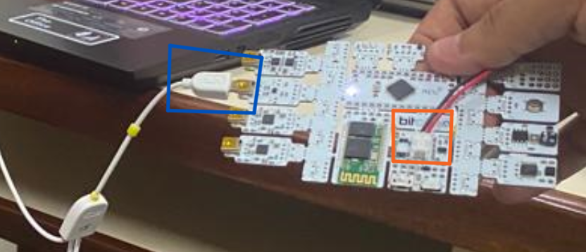

  
 Manual de usuario: https://support.pluxbiosignals.com/wp-content/uploads/2021/11/bitalino-revolution-user-manual.pdf"

  
Vamos a utilizar el puerto A2, señalado en el recuadro azul pues este nos permitirá obtener la señal de la actividad del músculo, electromiografía (EMG).

  
Para poder alimentar la placa conectaremos la fuente de poder que será una batería de litio (recuadro anaranjado).

  
  </ul>
<h2 id="obt">Obtención de la señal </h1>

 Una vez colocados los electrodos, se puede observar en la pantalla de la laptop la señal en silencio eléctrico o reposo, que es cuando el músculo del brazo  está relajado. Después cuando el músculo se contrae, se puede observar actividad eléctrica en la señal, esto se debe a que las neuronas motoras transmiten señales eléctricas que hacen que los músculos se contraigan. Al terminar de tomar la muestra, gracias al software obtendremos archivos de la señal para poder analizarlos.

https://github.com/EduardoSalazarA/IntroSenales/blob/main/Videos/Adquisicion%20de%20ECG%20pac1.mp4

<h2 id="señalo">Señal en OpenSignals</h1>

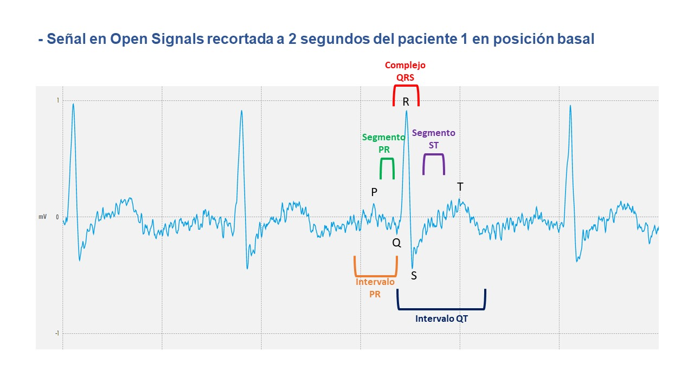

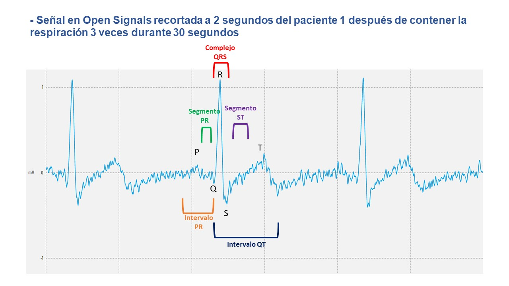

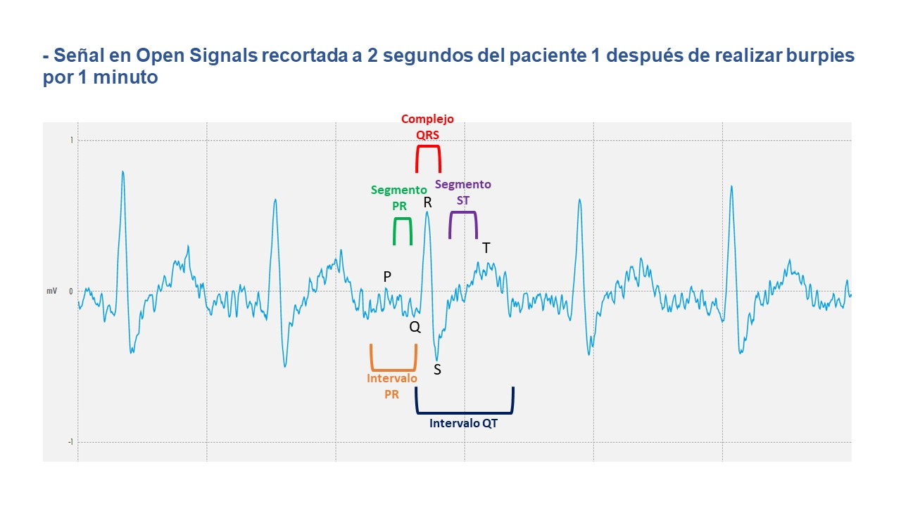

<h2 id="señalp">Señal en Python </h1>

 El archivo de texto obtenido del OpenSignal contiene 6 columnas de los cuales el último corresponde a la señal en bits que recibe el microcontrolador, esos valores se obtuvieron directamente en mV configurando el OpenSignals para que reciba la señal ECG. Después se procedio a plotear en python las señales usando las librerias numpy, matplotlib, pandas, seaborn y re. El codigo usado se encuentra en el siguiente link: (https://github.com/EduardoSalazarA/IntroSenales/blob/main/Software/Laboratorio%204_ECG)
  
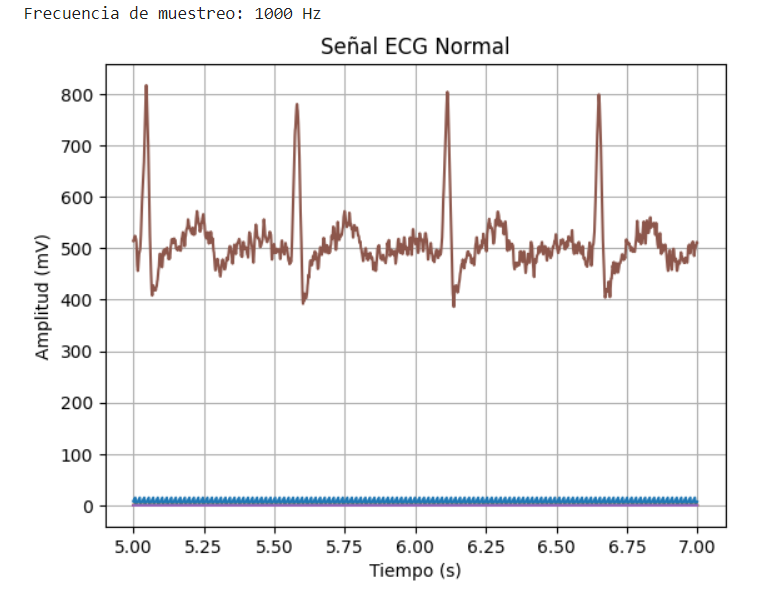

  
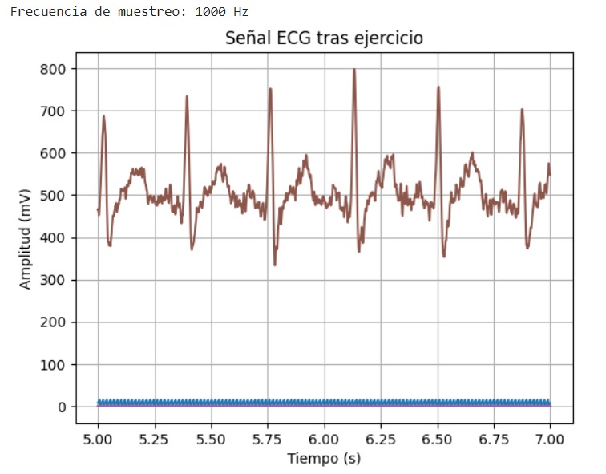

  
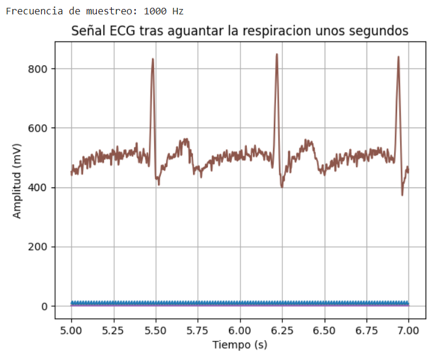

  
</ul>
<h2 id="disc">Discusión</h1>
<ul>
  
 Dados los resultados, podemos concluir que hay una evidente relacion entre la frecuencia cardiaca y la actividad fisica
</ul>
<h2 id="res">Resultados</h1>
<ul>
  <li> </a> Se puede observar que la frecuencia de la señal después de realizar ejercicios aumenta con respecto a la posición basal, asimismo las fases de la onda son más cortas y la amplitud máxima en el complejo QRS es menor.
  <li> </a> También se puede observar que la frecuencia de la señal obtenida después de contener la respiración es similar con respecto a la posición basal, de mismo modo las fases son similares sin embargo la amplitud máxima en el complejo QRS es mayor ya que sobrepasa los 1 mV.
</ul>

<h2 id="archiv">Archivos</h1>

[Archivos_BiTalino.zip](https://github.com/EduardoSalazarA/IntroSenales/files/11184266/Archivos_BiTalino.zip)
</ul> 

<h2 id="refs">Referencias </h1> 
<li> </a>1.	https://www.fbbva.es/microsites/salud_cardio/mult/fbbva_libroCorazon_cap4.pdf
<li> </a>2.	Servicio de Cardiología del Hospital Virgen de la Victoria (Málaga). [En línea]. Electrocardiograma. [Citado el 6 de octubre de 2020]. Disponible desde: http://www.medynet.com/usuarios/jraguilar/Manual%20de%20urgencias%20y%20 Emergencias/ecg.pdf
</ul> 
